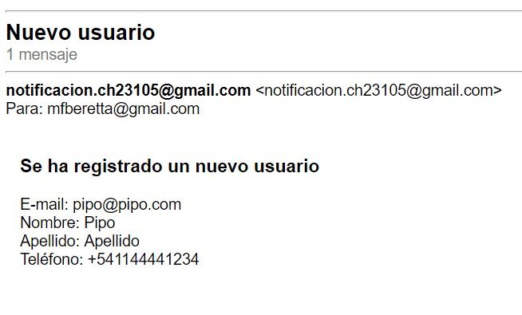
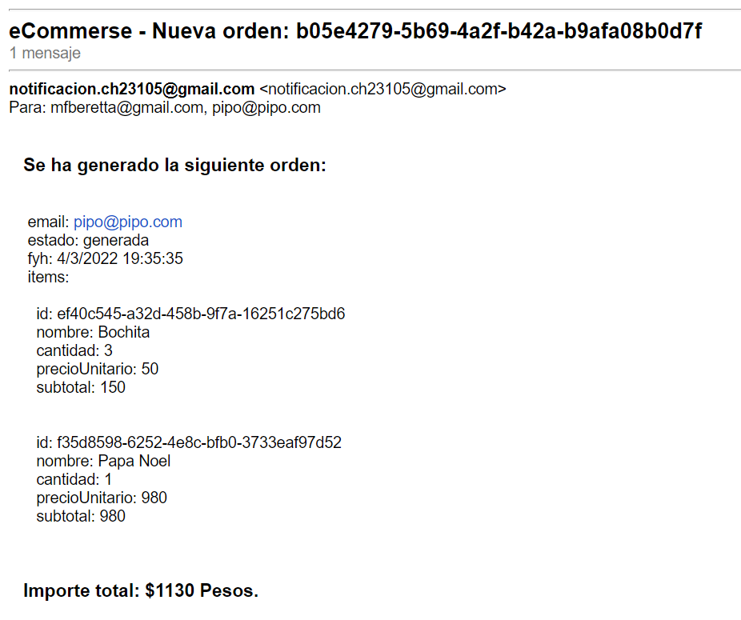

## Resolución de las consignas

Se desarrolló un Front que interactua con el Backend. Mediate el Font se pueden realizar todas las operaciones, el carrito y las órdenes se muestran solo las que corresponden al usuario logueado. Info, los productos y mensajes se muestran en comun para todos los usuarios, salvo para los mensajes que en donde hay una vista de los mensajes del usuario logueado.

Más allá del front el backend está toalmente expuesto mediante API REST, en el archivo excel en /docs/docs_apis.xlsx se detallan todos los métodos con sus endpoints, bodies si correspondiese y que devuelven.

Existe un usuario admin que tiene acceso a la creación de los productos, modificación y eliminación. El usuario es admin@e.commerse y password 4dm1n el resto de los usuarios no tienen acceso a estos endpoints.

Para probarlo mediante POSTMAN, en la carpeta postman del proyecto se encuetra la collection con todos los métodos implentados organizados en las carpetas: Productos, Carritos, Usuarios y Ordenes. El environment almacena las variables como el token e email luego del login o registro y luego se utilza en todas las operaciones envíandolo al backend en el header para su verificacion y autorización. También se almacenan el id de producto, carrito y orden.

De los requisitos extras opté por implementar la vista de mis órdenes, mostrando solo las órdenes del usuario logueado.

En la carpeta /docs también se adjunta imágenes de los mails recibidos en la casilla del admin al registarse un nuevo usuario y al generar la orden.

Se implenentó el proyecto en el PASS Heroku, estando disponible en https://mi-node.herokuapp.com/

## Consideraciones para probar los métodos en Postman:

Sobre los bodies:

Si bien está detallado en el archivo excel a continuación un resumen de los mismos:

1) Para crear un producto el body es el siguiente completando los datos de los campos (mandatorio):
    {
       "nombre": "",
       "descripcion": "",
       "codigo": "",
       "foto": "",
       "precio": "",
       "stock": ""
    }

El id y timestamp se asignan en el método.

2) Para actualizar un producto el body es el siguiente (el id es opcional el resto de los campos mandatorios, los campos que no se actualizan deben llevar el mismo valor)
   
    {
        "id": ,
        "timestamp": ,
        "nombre": "",
        "descripcion": "",
        "codigo": "",
        "foto": "",
        "precio": "",
        "stock": ""
    }

Se busca por el id que viene en el parámetro del request y de encontrarlo lo reemplazo por el producto del body

4) Para crear un carrito el body es el siguiente:

    {
        "direccion": "Juan B Justo 9B",
        "email": "user@email.com"
    }

La fecha/hora, el id y la estructra para contener los productos los asigna en el momento de creación del carrito.

5) Para registrar a un usuario:

    {
    "email": "user@email.com",
    "password": "1234",
    "password1": "1234",
    "nombre": "user",
    "apellido": "apellido",
    "telefono": "+541144441234"
}

Se chequea que password sea igual a password1

6) Para loguear a un usuario:

    {
        "email" : "user@email.com",
        "password": "1234"
    }